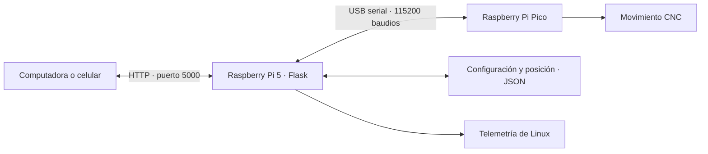

# Muro Verde OS — IPN

Sistema de riego inteligente basado en sistemas embebidos y movimiento cartesiano. Este repositorio reúne el servidor maestro de la Raspberry Pi 5, su interfaz web y la documentación del respaldo.

La versión principal es **Master_Control_V2.py**. Control de movimiento CNC y la consulta del estado del equipo; el respaldo no incluye firmware de la Pico, esquemas eléctricos ni control de válvulas o bombas.

## Funcionamiento



El navegador consulta la posición cada 300 ms y la telemetría cada 2 segundos. La Pi 5 envía comandos a la Pico y recibe mensajes de posición y finalización. La compatibilidad del protocolo debe verificarse con el firmware que esté instalado en la Pico.

## Contenido

```text
MuroVerde/
├── README.md
├── requirements.txt
├── .gitignore
├── Master_Control/
│   ├── Master_Control_V2.py
│   ├── static/
│   │   └── Escudo_ipn.png
│   └── templates/
│       ├── login.html
│       ├── panel.html
│       ├── control_riego.html
│       └── sistema.html
├── docs/
│   ├── instalacion.md
│   ├── arquitectura.md
│   ├── api-y-protocolo.md
│   ├── estado-del-respaldo.md
│   └── ejemplos/
│       ├── config_cnc.example.json
│       └── posicion_cnc.example.json
├── extras/oled/
│   ├── README.md
│   └── oled_monitor.py
└── legacy/
    ├── README.md
    ├── V1.py
    ├── control_motores.py
    ├── static/style.css
    └── templates/index.html
```

`config_cnc.json` y `posicion_cnc.json` son archivos locales de ejecución dentro de `Master_Control/`; Git los ignora. El primero se escribe al guardar la configuración y el segundo al recibir un mensaje `OK` de la Pico. Si faltan, el programa utiliza valores iniciales en memoria.

## Inicio en la Raspberry Pi 5

Con el repositorio en `/home/muroverde/MuroVerde/`:

```bash
sudo apt update
sudo apt install python3-flask python3-serial
cd /home/muroverde/MuroVerde/Master_Control/
python3 Master_Control_V2.py
```

Abre `http://<IP-DE-LA-PI>:5000` desde la misma red. El acceso incluido en el respaldo es usuario `admin` y contraseña `1234`.

**Comportamiento del arranque:** el script intenta terminar el proceso que use el puerto 5000 mediante `sudo fuser -k`. También abre el puerto serial y envía `G92` con la posición guardada. Revisa la [guía de instalación](docs/instalacion.md) antes de ejecutarlo sobre el equipo.

## Documentación

- [Instalación, ejecución y solución de problemas](docs/instalacion.md).
- [Arquitectura, pantallas y persistencia](docs/arquitectura.md).
- [API local y protocolo serial observado](docs/api-y-protocolo.md).
- [Inventario, límites y pendientes del respaldo](docs/estado-del-respaldo.md).
- [Monitor OLED opcional](extras/oled/README.md).
- [Versiones anteriores](legacy/README.md).

## Estado de esta integración

Los archivos Python, HTML, CSS y PNG se conservan sin cambios de contenido. Se organiza el respaldo y se añade documentación. El botón para cambiar Wi-Fi sigue en desarrollo y el modo denominado «Simulación» en V2 no simula desplazamientos.

El acceso y la clave de sesión están fijos en el código recibido, y `/api/estado` no exige sesión. La aplicación está planteada para una red local controlada; antes de publicarla en Internet se necesita revisar la autenticación y el despliegue.
